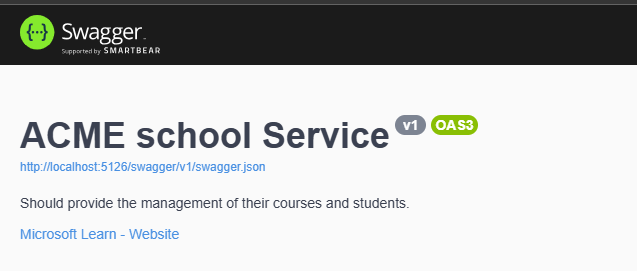
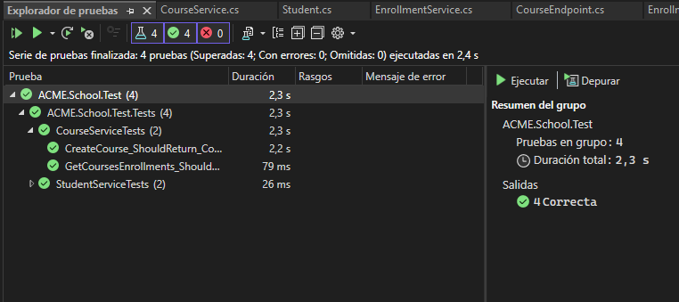

Steps for Runner application in local 

Note: for runner service of login, typing this is credentials
```shell
{
  "userId": "c0de77dd-adc7-4a25-ad0d-d89b4a69ca00",
  "password": "7ca86aef7868477"
}
```
1. Clone this repository:
```shell
$ git clone https://github.com/juan0331camilo/ACME.SchoolTechnicalTest
$ cd ACME.School
```
2. run project in editor code
  ## SwaggerIndex


## service Login


## service course enrollments


# tests of case for service stundent an course
 

# Deployment of services (frontend and backends) in Docker of the ACME School Platform
This repository contains the files and commands necessary to deploy the services (frontend and backends) in Docker of the ACME School Platform

 Steps for runner application in Docker.
1. Clone this repository:
```shell
$ git clone https://github.com/juan0331camilo/ACME.SchoolTechnicalTest
$ cd ACME.School
```

2. Build the Docker image:
```shell
$ docker build -t ms-acme-school -f ACME.School.WebApi.Dockerfile .
$ docker images
```

3. Run the Docker containers from the images:
```shell
$ docker run --name ms-acme-school -d -p 3000:8080 \
-e ASPNETCORE_ENVIRONMENT=Development \
ms-acme-school

$ docker ps
```

Note: You can also run containers from a Docker Compose:
```shell
$ docker-compose -p acme-school-platform --env-file .env.dev up -d --build
$ docker ps
```

4. Access the application http://localhost:3000

## ER Diagram and Relationships: A database schema that includes different types of relationships (e.g., one-to-one, one-to-many, many-to-many).

 

# Links
- Repo: https://github.com/juan0331camilo/ACME.SchoolTechnicalTest
- Docs ACME School Platform repo: https://github.com/juan0331camilo/ACME.SchoolTechnicalTest/Docs/prueba-tecnica.pdf
- Docker repo: https://hub.docker.com/repositories/juancamilo0331
- Killercoda Interactive Environments: https://killercoda.com/

# Decisions taken in project (explanation)
For this project, the decision was made to use a layered architecture, implementing design patterns and preparing some key components, such as JWT for generating tokens to secure the endpoints. Additionally, the database connection to SQL Server is already implemented in Azure.
The rest of the project consists of services, interfaces, entities, DTOs, a generic repository, and a Unit of Work.

# What things would you have liked to do but didn't do?
I would have liked implement payment gateway for project. 
also service for intructor of course relationships.

# What things did you do but do you think could be improved or would need to be returned to if the project moves forward?
I believe that login, I would liked implements more security for Apis

# What third party libraries did you use and why?
Entity framework for esay transaccion for entities, patters disings for application scalable and scalable and maintainable

## Components
- FluentValidation
- Swagger
- JWT Auth
- Minimal API Project
- Repository Pattern
- Data Transfer Objects Pattern
- AutoMapper
- HealthCheck Endpoints

# How much time you have invested in doing the project and what things you have had to research and what things were new to you?
- My time to implement the technical test was one week. 
- My investigation My research, more than anything, was in implementing minimal apis
